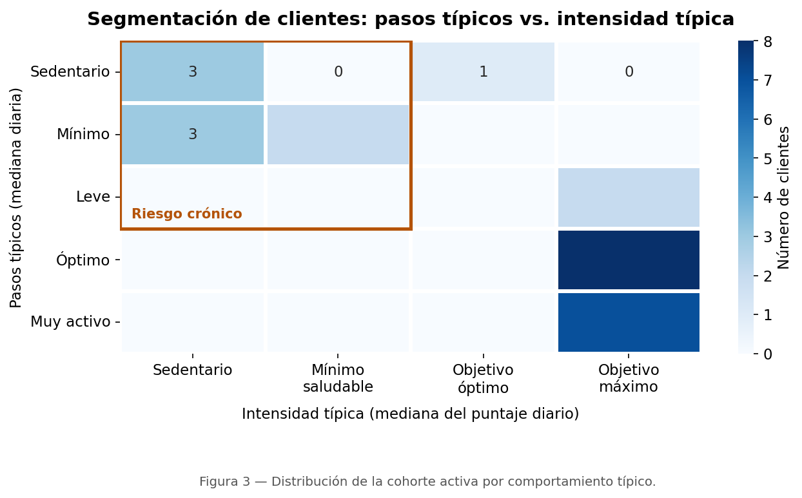
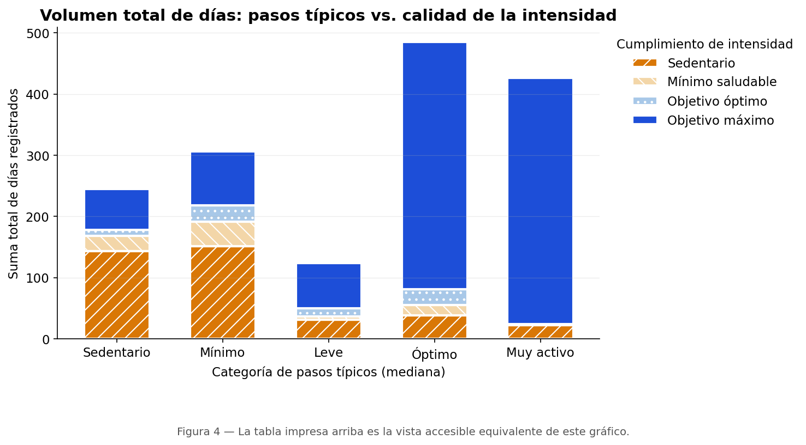
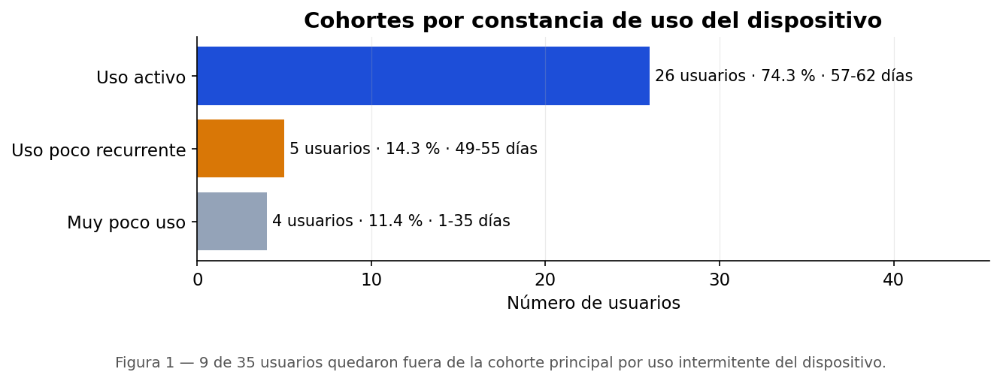

# 📈 Bellabeat Strategic Segmentation Analysis

*Análisis estratégico y segmentación de clientes para Bellabeat*

[](requirements.txt)
[](tests/)
[](LICENSE.MD)
[](https://creativecommons.org/licenses/by/4.0/)
[](https://nbviewer.org/github/MauricioVrx/Bellabeat-Strategic-Segmentation-Analysis/blob/main/bellabeat_segmentation_analysis.ipynb)

> **Descargo de responsabilidad.** Caso de estudio académico e independiente, con fines de
> portafolio. **No está afiliado, patrocinado ni avalado por Bellabeat, Fitbit ni Google.**
> «Bellabeat» y «Fitbit» son marcas registradas de sus titulares y se usan con fines
> identificativos y educativos. **No es consejo médico:** los umbrales de la OMS y del JACC
> son directrices poblacionales, no criterios de diagnóstico individual.

---

## 📑 Contenido

- [Resumen del proyecto](#resumen)
- [Hallazgos clave](#hallazgos)
- [Habilidades técnicas demostradas](#habilidades)
- [Cómo ejecutar](#ejecutar)
- [Estructura del repositorio](#estructura)
- [Limitaciones y validez](#limitaciones)
- [Recomendaciones estratégicas](#recomendaciones)
- [Licencias y procedencia](#licencias)

---

<a id="resumen"></a>

## 🎯 Resumen del proyecto

Caso de estudio de *Data Analytics* para [**Bellabeat**](https://bellabeat.com), empresa de
tecnología enfocada en el bienestar femenino. El objetivo es informar la estrategia de
crecimiento y marketing mediante la **segmentación de hábitos de actividad y consistencia**.

Se utiliza el dataset público de FitBit como *proxy*. La decisión de diseño central es
**segmentar en dos dimensiones a la vez** —volumen de pasos × intensidad efectiva— en lugar
de usar una sola métrica.

> ⚠️ El dataset **no contiene sexo, edad ni ubicación**, así que no puede afirmarse que
> represente a la base de clientas de Bellabeat. Por eso el documento usa lenguaje neutro y
> presenta sus resultados como **hipótesis a validar**, no como conclusiones.

---

<a id="hallazgos"></a>

## 📊 Hallazgos clave

### 1. Los clientes se agrupan en dos polos opuestos, no en un continuo



*21 de 26 personas (81 %) se concentran en las esquinas opuestas de la matriz. El cuadrante
**Viajero** (muchos pasos, baja intensidad) está vacío en esta muestra.*

| Segmento | Personas | Proporción (IC 95 %, Wilson) | ¿Concluyente? |
| :--- | :---: | :--- | :---: |
| **Saludable** | 15 | 58 % (39 – 74 %) | sí |
| **Sedentario** | 8 | 31 % (17 – 50 %) | sí |
| **Fuerte** | 3 | 12 % (4 – 29 %) | **no (n < 5)** |
| **Viajero** | 0 | 0 % (0 – 13 %) | — |

> Con n = 26, **una sola persona vale ≈ 3,8 puntos porcentuales**. Los porcentajes se
> reportan redondeados y con su intervalo de confianza; los segmentos con n < 5 se marcan
> explícitamente como no concluyentes.

### 2. El riesgo se concentra donde el volumen de pasos es bajo



*325 días sin alcanzar el umbral mínimo de la OMS provienen de los tres segmentos de pasos
bajos (Sedentario, Mínimo y Leve); 806 días de máximo rendimiento, de los dos segmentos de
pasos altos (Óptimo y Muy activo).*

### 3. El hallazgo del enfoque bidimensional: el cliente «Fuerte»

Existe un grupo con **pocos pasos pero alta intensidad** — probable entrenamiento de fuerza,
ciclismo o natación, actividades que un podómetro subestima. Una segmentación basada solo en
pasos los habría clasificado como *población en riesgo*, y la campaña les habría enviado el
mensaje equivocado.

> Con n = 3 es una **hipótesis**, no una conclusión. Se reporta porque el coste de
> equivocarse tratándolos como sedentarios es asimétricamente alto.

### 4. Una cuarta parte de la muestra usa el dispositivo de forma intermitente



*9 de 35 personas (26 %) quedaron fuera de la cohorte de comportamiento por uso intermitente.
De ellas, 5 conservan datos suficientes para una campaña de re-enganche.*

> Es importante **no** leer esto al revés: la completitud del 98 % dentro de la cohorte
> analizada es alta **por construcción**, porque la cohorte se define por tener pocos días
> faltantes. El dato con valor de negocio es la tasa de exclusión, no la de completitud.

### 5. Validez de la métrica construida

| Correlación | r | Unidad de observación |
| :--- | :---: | :--- |
| Intensidad ↔ calorías (registro crudo por minuto) | 0,91 | minuto |
| Puntaje de actividad combinada ↔ calorías | **0,76** | día-usuario |
| Puntaje de actividad combinada ↔ pasos | **0,85** | día-usuario |

El puntaje construido correlaciona con el gasto calórico lo bastante para ser coherente, y
lo bastante poco con los pasos para **no ser redundante** con ellos.

> ⚠️ Las correlaciones diarias se calculan sobre días-usuario, que son medidas repetidas de
> 26 personas. Hay **pseudorreplicación**: el n efectivo está más cerca de 26 que de 1 586.
> El notebook recalcula cada una agregando por persona y reporta ambas.

---

<a id="habilidades"></a>

## 🛠️ Habilidades técnicas demostradas

* **Auditoría de datos.** Se detectaron y corrigieron errores del dataset original: los
  valores de MET venían **multiplicados por diez** y había errores de conversión entre
  minutos, horas y días. El dataset corregido se publicó en
  [Kaggle](https://www.kaggle.com/datasets/mvr513/fitbit-fitness-tracker-data-corrected).
* **Ingeniería de datos (ETL).** Pipeline separado en su propio repositorio:
  [Fitbit-Data-Cleaning-ETL](https://github.com/MauricioVrx/Fitbit-Data-Cleaning-ETL).
* **Feature engineering derivado de la teoría.** El `combined_activity_score`
  (`2 × minutos vigorosos + minutos moderados`) aplica la equivalencia exacta que define la
  OMS: 75 min vigorosos ≡ 150 min moderados.
* **Umbrales basados en evidencia.** Los cortes proceden de las
  [directrices de la OMS](https://iris.who.int/items/65310979-92e8-4c98-8092-5a16ca07fc2f)
  y de un [meta-análisis del JACC (2023)](https://www.jacc.org/doi/10.1016/j.jacc.2023.07.029),
  no del popular objetivo de 10 000 pasos (una campaña publicitaria japonesa de 1965, sin
  base clínica).
* **Cuantificación de la incertidumbre.** Intervalos de Wilson en cada proporción y
  corrección explícita de la pseudorreplicación en las correlaciones.
* **Código probado.** La lógica de análisis vive en `src/bellabeat/` con **44 tests**
  (`pytest`), incluida una prueba de regresión del bug de segmentación con cuadrantes vacíos.
* **Herramientas:** Python · pandas · NumPy · Matplotlib · Seaborn · pytest · Jupyter.

---

<a id="ejecutar"></a>

## 🚀 Cómo ejecutar

### 1. Entorno

```bash
git clone https://github.com/MauricioVrx/Bellabeat-Strategic-Segmentation-Analysis.git
cd Bellabeat-Strategic-Segmentation-Analysis

python -m venv .venv
.venv\Scripts\activate          # Windows
# source .venv/bin/activate     # macOS / Linux

pip install -r requirements.txt
```

Alternativa con conda:

```bash
conda env create -f environment.yml
conda activate bellabeat-segmentation
```

### 2. Datos

Los datos **no** se incluyen en el repositorio. Descarga el dataset ya corregido:

👉 <https://www.kaggle.com/datasets/mvr513/fitbit-fitness-tracker-data-corrected>

Descomprime de forma que la estructura quede exactamente así:

```
data/
├── export_3.12.16-4.11.16/
│   ├── dailyActivity.csv
│   ├── minuteIntensities.csv
│   ├── minuteCalories.csv
│   └── minuteSteps.csv
└── export_4.12.16-5.12.16/
    └── (los mismos cuatro archivos)
```

> *Alternativa:* para partir de los datos crudos, usa el pipeline
> [Fitbit-Data-Cleaning-ETL](https://github.com/MauricioVrx/Fitbit-Data-Cleaning-ETL), que
> genera esta estructura automáticamente.

### 3. Ejecutar el análisis

```bash
jupyter lab bellabeat_segmentation_analysis.ipynb
# Kernel -> Restart Kernel and Run All Cells
```

Los datos por minuto son ~2,7 millones de filas: reserva unos **2 GB de RAM**.

### 4. Ejecutar los tests

```bash
pip install -r requirements-dev.txt
pytest tests -q
```

Los tests **no necesitan los datos**: usan frames sintéticos.

---

<a id="estructura"></a>

## 📁 Estructura del repositorio

```
├── bellabeat_segmentation_analysis.ipynb   # Análisis: narrativa, tablas y figuras
├── src/bellabeat/                          # Lógica de análisis (probada)
│   ├── config.py         # Umbrales, con su fuente. Sin números mágicos
│   ├── loading.py        # Lectura de CSV, fechas y consolidación
│   ├── features.py       # Puntaje combinado, calorías, banderas, cohortes
│   ├── segmentation.py   # Categorización y asignación de segmentos
│   ├── stats.py          # Intervalos de Wilson, pseudorreplicación
│   └── plots.py          # Sistema visual y figuras
├── tests/                                  # 27 tests con pytest
├── docs/
│   ├── img/                                # Figuras usadas en este README
│   └── make_readme_figures.py              # Regenera esas figuras
├── data/                                   # (no versionado) datos de entrada
├── requirements.txt · environment.yml      # Entorno
└── LICENSE.MD
```

---

<a id="limitaciones"></a>

## ⚠️ Limitaciones y validez

Este análisis usa **datos proxy**. Sus conclusiones son **hipótesis a validar con datos
propios de Bellabeat**, no conclusiones transferibles directamente.

| Limitación | Alcance | Impacto |
| :--- | :--- | :--- |
| **Sin datos demográficos** | No hay sexo, edad ni ubicación | No puede afirmarse representatividad de la base de Bellabeat. **Es la limitación principal** |
| **Muestra pequeña** | n = 26 tras filtrar (de 35) | Cada persona mueve ≈ 3,8 pp. Segmentos con n < 5 no son concluyentes |
| **Antigüedad** | Datos de marzo–mayo de **2016** | Casi una década de cambio en hardware, hábitos y mercado |
| **Ventana corta y estacional** | 62 días, solo primavera boreal | Sin control de estacionalidad |
| **Muestra autoseleccionada** | Voluntarios de Mechanical Turk que ya usaban Fitbit | Sesgo hacia personas motivadas por el *fitness* |
| **Cohorte filtrada** | Solo ≥ 57 días registrados | La completitud es alta por construcción; el 26 % fue excluido |
| **Medidas repetidas** | Correlaciones sobre días-usuario | Pseudorreplicación; se reportan como descriptivas |
| **Dispositivo no médico** | Fitbit no está certificado como tal | Los umbrales son poblacionales, no diagnósticos |

**Qué haría falta para convertir esto en una decisión de negocio:** datos propios con
demografía · un periodo de ≥ 6 meses · n ≥ 200 por segmento · datos de conversión y
retención para conectar segmento con valor de cliente.

---

<a id="recomendaciones"></a>

## 🚀 Recomendaciones estratégicas

> **Separación explícita entre datos y supuestos.** El análisis determina **a quién**
> dirigirse y **qué comportamiento** tiene cada segmento. Los atributos de producto
> (materiales, autonomía, diseño) **no proceden de este análisis**: son el posicionamiento
> declarado de la marca y deben confirmarse con el equipo de producto antes de usarse.

| # | Recomendación | Segmento objetivo | Respaldo |
| :-: | :--- | :--- | :--- |
| 1 | Destacar resistencia de materiales | Fuerte, Saludable | *Supuesto de producto* |
| 2 | Destacar diseño discreto para entornos de oficina | Sedentario | *Supuesto de producto* |
| 3 | Destacar autonomía: menos recargas → registro más completo | Todos | Parcial (la completitud separa las cohortes) |
| 4 | Énfasis en monitorización de sueño | Todos | **Parcial** — el notebook comprueba primero si las noches sin registro son fallo del sensor o no-uso nocturno |
| 5 | Campaña de re-enganche con mensaje de monitoreo holístico | Uso poco recurrente | **Respaldado por los datos** |

**Cómo se mediría el éxito:** test A/B por segmento, con días activos a 30 días como KPI
primario, tasa de uso nocturno como secundario y tasa de bajas como métrica de contención.
El criterio de éxito se fija **antes** de lanzar, lo que determina el tamaño de muestra.

---

<a id="licencias"></a>

## 📄 Licencias y procedencia de los datos

| Elemento | Origen | Licencia |
| :--- | :--- | :--- |
| **Código** (notebook, `src/`, `tests/`) | Este repositorio | [MIT](LICENSE.MD) |
| **Contenido** (texto, gráficos, conclusiones) | Este repositorio | [CC BY 4.0](https://creativecommons.org/licenses/by/4.0/) |
| Datos crudos | [Kaggle / Möbius](https://www.kaggle.com/datasets/arashnic/fitbit), 2016 | CC0 1.0 (dominio público) |
| Datos corregidos | [Kaggle / este autor](https://www.kaggle.com/datasets/mvr513/fitbit-fitness-tracker-data-corrected) | CC0 1.0 |
| Código ETL | [Fitbit-Data-Cleaning-ETL](https://github.com/MauricioVrx/Fitbit-Data-Cleaning-ETL) | MIT |

**Nota sobre datos personales.** El análisis emplea datos de salud pseudonimizados
publicados bajo CC0. Aunque el `Id` no identifica directamente a una persona, bajo el RGPD
(art. 4.5 y 9) constituye un dato personal de categoría especial. En un entorno productivo
con datos reales de clientas, este análisis exigiría: base legal explícita de tratamiento,
minimización de datos, evaluación de impacto (EIPD/DPIA) y política de retención.

---

* **Autor:** Mauricio Villanueva
* **LinkedIn:** <https://linkedin.com/in/mauricio-villanueva-rivera>
* **Tableau:** <https://public.tableau.com/app/profile/mauricio.villanueva>
* **Kaggle:** <https://www.kaggle.com/mvr513>
